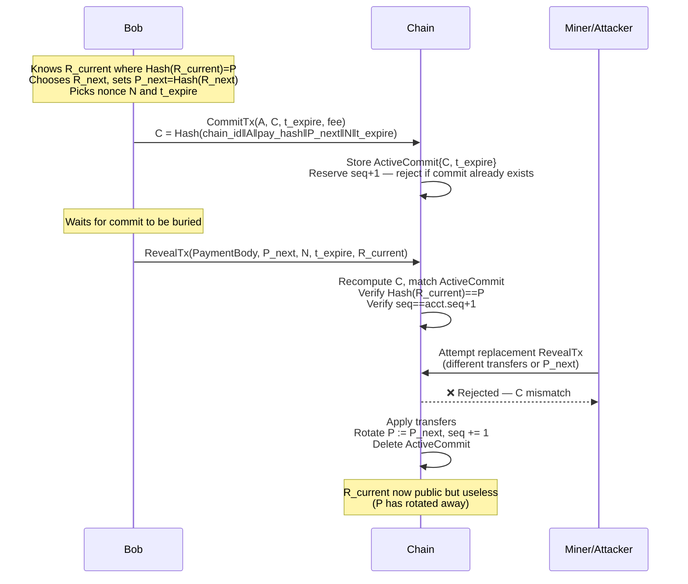

# Signatureless Commit–Reveal Blockchain Scheme

A concise specification of the hash-only, account-based commit–reveal protocol for authorising payments without signatures.

---

## Overview

This scheme enables outgoing payments from an account using **only hash preimage revelation** — no public-key signatures required. A two-phase commit–reveal flow prevents a malicious miner from replacing Bob's intended payment once the spend secret becomes visible.

---

## Account State

Each account has a stable, static identifier `A` (Bob's public "address") and the following mutable state:

```
AccountState {
  balance  : uint64
  seq      : uint64   // monotonically increasing; anti-replay and ordering
  P        : bytes32  // current auth hash = Hash(R_current)
}
```

### Wallet Secrets (never on-chain)

| Secret | Description |
|--------|-------------|
| `S` | Master seed, kept secret forever |
| `R_k` | Per-step spend secret: `R_k = Hash("R" \|\| S \|\| k)` (or a KDF) |
| `R_current` | The secret whose hash equals `acct.P` right now |

---

## Receiving Funds (offline-compatible)

Anyone can credit Bob's account at any time without his involvement:

```
TransferTx { from: <sender>, to: A, amount: <value> }
```

No spend secret is required; `A` is static and never changes.

---

## Spending Funds: Two-Phase Commit–Reveal

### Why two phases?

When `R_current` becomes visible during a reveal, a malicious miner could substitute their own transaction for Bob's if only a simple "reveal → spend" step existed. Pre-committing to the full `PaymentBody` on-chain before revealing `R_current` prevents this substitution: a replacement transaction would need to match the already-recorded commitment hash, which it cannot.

### Phase 1 — CommitTx

Bob posts a commitment hash **without** revealing `R_current`:

```
CommitTx {
  account  : A
  C        : bytes32   // commitment hash (see below)
  t_expire : uint64    // block height / timestamp deadline
  fee      : uint64
}
```

**Commitment hash construction:**

```
pay_hash = Hash(Encode(PaymentBody))

C = Hash(
  "SIGLESS_COMMIT_V1" ||
  chain_id            ||
  A                   ||
  pay_hash            ||
  P_next              ||   // rotation target committed here
  N                   ||   // random nonce chosen by Bob
  t_expire
)
```

**Consensus rules for CommitTx:**

- Deduct `fee` from `acct.balance`.
- Record `ActiveCommit { C, t_expire }` keyed by `acct.id`.
- **Require `seq_in_commit == acct.seq + 1`** at commit time (reserves the next sequence slot).
- **Reject if an active commit already exists** for this account (at most one active commit at a time).

### Phase 2 — RevealTx

After the commit is sufficiently buried, Bob (or anyone with the reveal material) broadcasts:

```
RevealTx {
  payment_body : PaymentBody   // { from: A, seq, transfers, fee }
  P_next       : bytes32       // new auth hash after rotation
  N            : bytes32       // nonce used in CommitTx
  t_expire     : uint64
  R_current    : bytes32       // preimage reveal — authorises the spend
}
```

**Consensus validation pseudocode:**

```
validate_reveal(tx, acct, h):
  assert tx.payment_body.from == acct.id

  // Recompute commitment and find it on-chain
  pay_hash   = Hash(Encode(tx.payment_body))
  C_expected = Hash("SIGLESS_COMMIT_V1" || chain_id || acct.id ||
                    pay_hash || tx.P_next || tx.N || tx.t_expire)
  commit = ActiveCommitStore.get(acct.id, C_expected)
  assert commit exists
  assert h <= commit.t_expire            // not expired

  // Authorisation: knowledge of current spend secret
  assert Hash(tx.R_current) == acct.P

  // Replay protection
  assert tx.payment_body.seq == acct.seq + 1

  // Balance check
  total_cost = sum(amounts) + tx.payment_body.fee
  assert acct.balance >= total_cost

  // Apply transfers
  acct.balance -= total_cost
  for (to, amount) in tx.payment_body.transfers:
      Accounts[to].balance += amount

  // Key rotation (R_current is now useless)
  acct.P    = tx.P_next
  acct.seq += 1

  // Consume commitment — cannot be replayed
  ActiveCommitStore.delete(acct.id, C_expected)
```

**Expiry:** If `RevealTx` is not included before `t_expire`, the active commit is deleted (lazily or at block processing time). No funds are held locked beyond the already-paid commit fee. Bob may then issue a fresh `CommitTx`.

---

## Key Properties

| Property | How achieved |
|----------|--------------|
| Static receiving address | `A` never changes; receiving requires no secret |
| No master secret reveal | Only `R_current` is ever revealed; `S` stays off-chain |
| Replacement-theft prevention | `C` binds `PaymentBody + P_next` before `R_current` is visible |
| Anyone-can-reveal | `RevealTx` is fully deterministic; copying it changes nothing |
| Replay protection | `seq` increments per successful spend; commit is consumed |
| DoS containment | Commit fee + one-active-commit-per-account rule |

---

## Sequence Diagram



---

## Threat Model Summary

- **Miner replacement attack at reveal time:** Prevented — the commitment `C` locks `PaymentBody` and `P_next` before `R_current` is visible.
- **Replay attack:** Prevented — `seq` is single-use and the active commit is consumed on execution.
- **Front-running (copy exact RevealTx):** Harmless — copying the transaction verbatim produces the same outcome for Bob.
- **Master seed compromise:** Not mitigated by this protocol; `S` must be protected off-chain.
